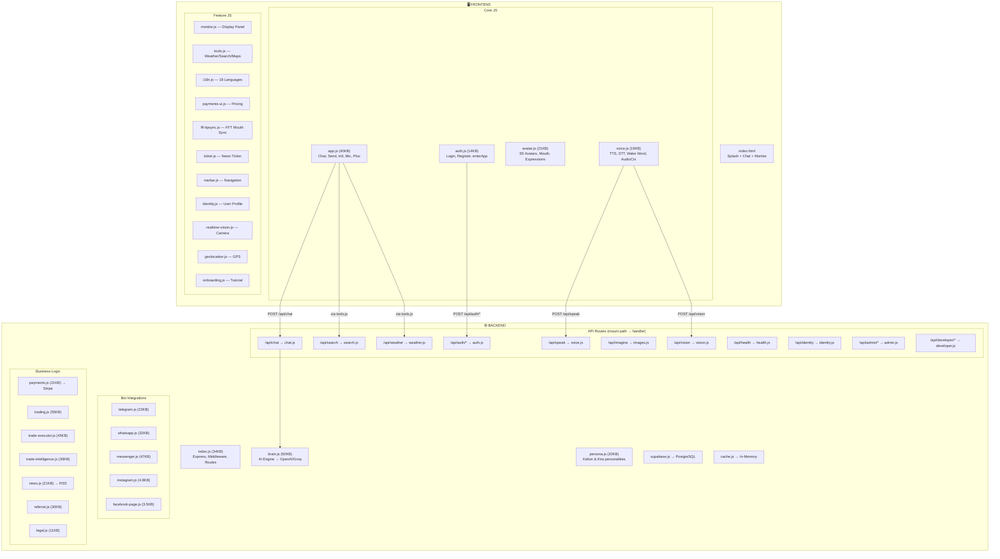
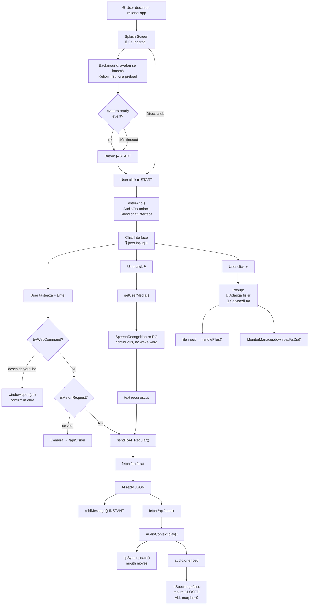

# Schema Logică Integrală — KelionAI (Post-Audit)

## Arhitectura Completă



---

## Flux Utilizator — CORECT (post-audit)



---

## Erori de Logică Confirmate

### ❌ ERR-1: Două SpeechRecognition CONCURENTE

|             |                                                                                                                  |
| ----------- | ---------------------------------------------------------------------------------------------------------------- |
| **Fișiere** | `app.js:625` + `app.js:511-539`                                                                                  |
| **Cauză**   | L625: `KVoice.startWakeWordDetection()` pornește SR#1. Mic toggle L511: pornește SR#2. Browser permite doar UNA. |
| **Efect**   | Mic nu aude vocea / nu se face verde                                                                             |
| **Fix**     | Stop wake word când mic ON. Restart când mic OFF.                                                                |

### ❌ ERR-2: Wake Word fără permisiune

|            |                                                                       |
| ---------- | --------------------------------------------------------------------- |
| **Fișier** | `app.js:625`                                                          |
| **Cauză**  | `startWakeWordDetection()` rulează la init(), ÎNAINTE de getUserMedia |
| **Efect**  | SpeechRecognition fail silențios ("not-allowed")                      |
| **Fix**    | NU porni wake word la init. Doar după click 🎙️.                       |

### ❌ ERR-3: Triple startWakeWordDetection

|             |                                                        |
| ----------- | ------------------------------------------------------ |
| **Fișiere** | `app.js:625` + `auth.js:130` + potențial mic toggle    |
| **Cauză**   | Se apelează din 3 locuri diferite                      |
| **Efect**   | Multiple instanțe SpeechRecognition                    |
| **Fix**     | Singura sursă: butonul 🎙️. Scos din init() și auth.js. |

### ❌ ERR-4: Plus popup ASCUNS

|            |                                                                  |
| ---------- | ---------------------------------------------------------------- |
| **Fișier** | `app.js:588`                                                     |
| **Cauză**  | `top:36px` poziționează popup SUB buton = sub marginea ecranului |
| **Efect**  | Popup invizibil sau parțial vizibil                              |
| **Fix**    | `bottom:44px` (deasupra butonului)                               |

### ❌ ERR-5: unlockAudio duplicat spam

|            |                                                                                                                                           |
| ---------- | ----------------------------------------------------------------------------------------------------------------------------------------- |
| **Fișier** | `app.js:488` + `app.js:627`                                                                                                               |
| **Cauză**  | L488: listener PERMANENT pe click (once:false). L627: alt listener cu once:true. Plus unlockAudio() creează AudioContext la fiecare apel. |
| **Efect**  | AudioContext spam, memory leak                                                                                                            |
| **Fix**    | Scoate L627. Fix L488 cu `{ once: true }`.                                                                                                |

### ❌ ERR-6: START buton text static

|            |                                                                          |
| ---------- | ------------------------------------------------------------------------ |
| **Fișier** | `index.html:288`                                                         |
| **Cauză**  | "⏳ Loading..." — user crede trebuie să aștepte, dar butonul E clickable |
| **Efect**  | UX confuz                                                                |
| **Fix**    | Initial "⏳ Se încarcă...", la avatars-ready → "▶ START"                 |

### ❌ ERR-7: isSpeaking state leak

|            |                                                                           |
| ---------- | ------------------------------------------------------------------------- |
| **Fișier** | `voice.js:119, 196`                                                       |
| **Cauză**  | Dacă audio decode fail dar isSpeaking=true deja setat, poate rămâne stuck |
| **Efect**  | Gura nu se mai închide, wake word blocat                                  |
| **Fix**    | Try/catch mai agresiv, always false la orice eroare                       |

### ❌ ERR-8: handleFiles closure bug

|            |                                                                                           |
| ---------- | ----------------------------------------------------------------------------------------- |
| **Fișier** | `app.js:419-441`                                                                          |
| **Cauză**  | `var file = fileList[i]` + `reader.onload = async function()` — `file` se schimbă în loop |
| **Efect**  | Ultimul fișier procesat pt toate                                                          |
| **Fix**    | `let` sau IIFE wrapper                                                                    |

### ❌ ERR-9: sendToAI_Regular nu face showThinking

|            |                                                            |
| ---------- | ---------------------------------------------------------- |
| **Fișier** | `app.js:188`                                               |
| **Cauză**  | Funcția nu apelează showThinking(true) — depinde de caller |
| **Efect**  | Minor (callers fac). Risk: future callers fără.            |
| **Fix**    | Adaugă showThinking(true) la început                       |

### ❌ ERR-10: SpeechRecognition lang hardcoded

|            |                                        |
| ---------- | -------------------------------------- |
| **Fișier** | `app.js:516`                           |
| **Cauză**  | `lang = 'ro-RO'` hardcoded             |
| **Efect**  | Utilizatori en/de/fr nu sunt înțeleși  |
| **Fix**    | Detect din i18n sau navigator.language |

---

## Plan de Rewrite — Fix-uri Exacte

### 1. `index.html`

```diff
-<button id="start-btn">⏳ Loading...</button>
+<button id="start-btn">⏳ Se încarcă...</button>
```

### 2. `auth.js`

```diff
 // enterApp function
-if (window.KVoice) { KVoice.ensureAudioUnlocked(); KVoice.startWakeWordDetection(); }
+if (window.KVoice) { KVoice.ensureAudioUnlocked(); }

 // avatars-ready event
+var startBtn = document.getElementById('start-btn');
+if (startBtn) startBtn.innerHTML = '▶ START';
```

### 3. `app.js` — init()

```diff
 // Remove auto wake word
-if (window.KVoice) KVoice.startWakeWordDetection();
-document.addEventListener('click', function unlockAudio() { ... }, { once: true });

 // Fix unlockAudio listeners
-['click', 'touchstart', 'keydown'].forEach(function(e) {
-  document.addEventListener(e, unlockAudio, { once: false, passive: true });
-});
+['click', 'touchstart', 'keydown'].forEach(function(e) {
+  document.addEventListener(e, unlockAudio, { once: true, passive: true });
+});
```

### 4. `app.js` — mic toggle

```diff
 // Stop wake word before starting direct speech
+if (window.KVoice && KVoice.stopWakeWordDetection) KVoice.stopWakeWordDetection();
 window._directSpeech = new SR();
-window._directSpeech.lang = 'ro-RO';
+window._directSpeech.lang = (window.i18n && i18n.getLanguage()) || navigator.language || 'ro-RO';

 // On mic OFF, restart wake word
 micOn = false;
 if (window._directSpeech) { ... }
```

### 5. `app.js` — plus popup

```diff
-popup.style.cssText = '...top:36px;right:8px...';
+popup.style.cssText = '...bottom:44px;right:0...';
```

### 6. `app.js` — handleFiles

```diff
-for (var i = 0; i < fileList.length; i++) {
-    var file = fileList[i];
+for (let i = 0; i < fileList.length; i++) {
+    let file = fileList[i];
```

### 7. `avatar.js` — mouth force-close (optimize)

```diff
 // Cache mouth morph indices at load time, not per frame
+var _mouthMorphCache = [];
+function cacheMouthMorphs() {
+    _mouthMorphCache = [];
+    morphMeshes.forEach(function(m) {
+        if (!m.morphTargetDictionary || !m.morphTargetInfluences) return;
+        Object.keys(m.morphTargetDictionary).forEach(function(k) {
+            var kl = k.toLowerCase();
+            if (kl.indexOf('mouth')>=0 || kl.indexOf('jaw')>=0 ||
+                kl.indexOf('viseme')>=0 || kl.indexOf('lip')>=0 || kl==='smile') {
+                _mouthMorphCache.push({ mesh: m, idx: m.morphTargetDictionary[k] });
+            }
+        });
+    });
+}

 // In animate():
-morphMeshes.forEach(function(m) { ... });  // 250 string compares/frame
+_mouthMorphCache.forEach(function(c) { c.mesh.morphTargetInfluences[c.idx] = 0; });
```
